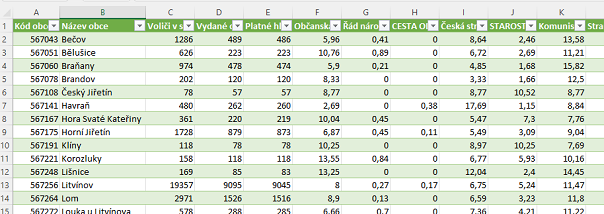

# Elections Scraper
3 projekt pro Engeto Python Academy

## Popis projektu
Tento projekt slouží k extrahování výsledků voleb do poslanecké snmovny z roku 2017 ze stránek [Českého Statistického Úřadu](https://www.volby.cz/pls/ps2017nss/ps3?xjazyk=CZ#4).

## Knihovny
Ke správné funkci programu je nezbytné doinstalovat několik knihoven. Jejich seznam naleznete v souboru `requirements.txt`. Pro instalaci doporučuji použít příslušné virtuální prostředí a instalaci spustit pomocí manažera balíčků **pip** následovně:

```
pip --version                        # Ověení přítomnosti a verze pip manažera
pip install -r requirements.txt      # Instalace potřebných knihoven
```

## Spuštění projektu
Program `volby.py` se spouští z příkazové řádky nebo okna terminálu a vyžaduje 2 povinné argumenty v uvozovkách:
```
py volby.py "URL stránky vybraného okresu" "název cílového souboru.csv"
```
### Příklad:
Chceme výsledky hlasování pro okres Most. Zadáme následující parametry a spustíme soubor:  
1 argument: 'https://www.volby.cz/pls/ps2017nss/ps32?xjazyk=CZ&xkraj=6&xnumnuts=4205'  
2 argument: 'Vysledky_Most.csv'  

Spuštění:  
```
py volby.py 'https://www.volby.cz/pls/ps2017nss/ps32?xjazyk=CZ&xkraj=6&xnumnuts=4205' 'Vysledky_Most.csv'
```
Průběh:  
```
Stahuji data z URL: .......  
Data byla úspěšně uložena do souboru: Vysledky_Most.csv
```
Výsledný soubor naleznete v adresáři projektu. Je možné jej dále zpracovávat v libovolném tabulkovém procesoru...  

